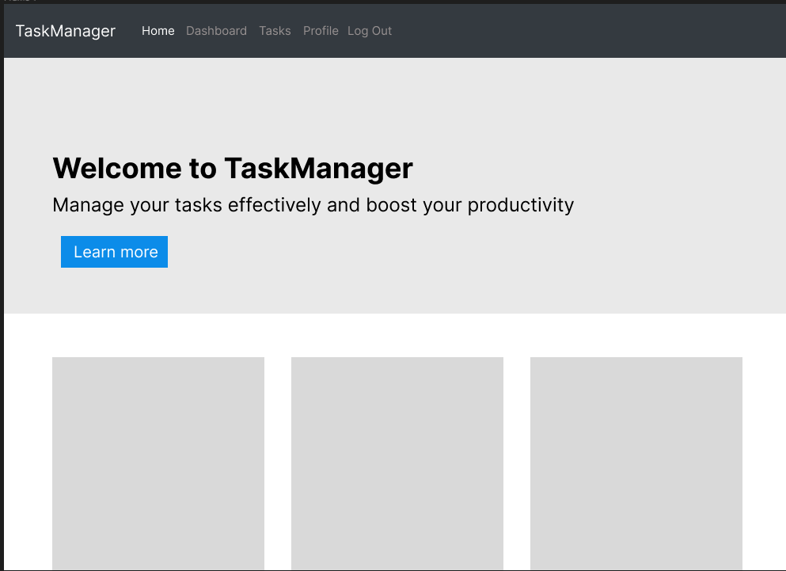

# Task Manager Application

This Task Manager is a web application designed to help users efficiently manage their tasks. It provides a user-friendly interface for tracking, organizing, and updating tasks. The application is built with Bootstrap for responsive design and functionality, ensuring it works seamlessly across various devices.
## Code Files

The project consists of several HTML files structured for different functionalities:

- `index.html`: The home page of the application.
- `dashboard.html`: The main dashboard page for task management.
- `tasks.html`: The page where tasks are displayed and can be managed.
- `login.html`: The login page for user authentication.
- `register.html`: The registration page for new users.
- `profile.html`: The user profile page for account information management.
- `authentication.html`: The logout confirmation page.

## Figma Design

The UI design was crafted using Figma. Here are the Figma designs and corresponding images for a visual guide through the app's layout and functionality.

 : https://www.figma.com/design/8tIl0VUqTxAj5pzVktvwxi/Untitled?node-id=0%3A1&t=vks4DpYvfk3zScbG-1

## References
https://getbootstrap.com/docs/5.3/getting-started/introduction/
https://getbootstrap.com/docs/5.1/forms/overview/
https://getbootstrap.com/docs/5.1/components/navs-tabs/
some LLMs for code formatting and correction

